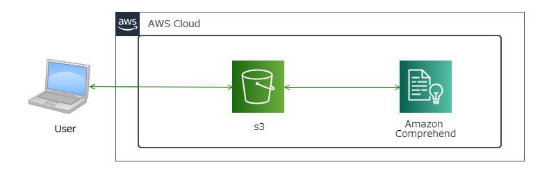
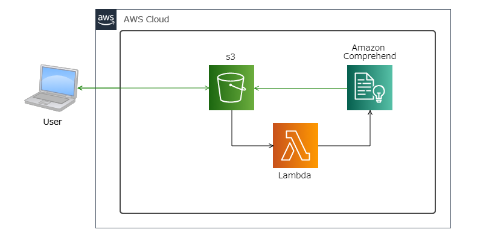

## <u>AWSのサービスを用いたSNSマーケティングサイトの構築を目指す</u>  

雑多な情報が飛び交うSNSの中から、特定ワードを指定して  
SNS上でそのワードに対してどのような感情を抱いているのか解析を行う

---

### 使用予定技術
 - SNS側のAPI（Twitterを予定）

 - AmazonComprehend  
   自然言語解析・感情分析

 - AmazonTranscribe  
   音声認識

 - AmazonRekognitin(?)   
   画像解析

---

### ステップ

- WEBマーケティングとは？  
  - [x] 書籍を読んでレポーティング  

- アウトプットイメージ及びサービス構成などの設計  
  - [ ] 随時実施  

- SNSのAPIを使用した特定ワードの情報取得  
  - [x] TwitterAPI申請  
  - [x] APIキーの払い出し終了  
  - [x] PythonのTweepyを使用して情報取得  

- 取得情報に対して「自然言語解析・感情分析」を実施  
  - [x] STEP1 S3にデータをおいて手動で感情分析（Comprehed)  
  - [x] STEP2 S3にデータをおいて手動でキーフレーズ抽出（Comprehed)  
  - [x] STEP3 Lambda関数からComprehend実行  
  - [ ] STEP4 （仮）Twitter検索用のWEBサイト作成  
  - [ ] STEP5 （仮）Amazon Quicksightを用いて解析結果をグラフ化  
               テキストマイニング、頻出ワードの可視化

 - その他上記に画像解析や音声認識での検索も詰め込めるか？  
  - [ ] （仮）音声分析  

---

### アウトプットイメージ及びサービス構成などの設計(随時更新)  

- 1、2STEP目の構成、まずは、シンプルに手動で  

- 3STEP目の構成、Lambda関数からComprehend実行    

　
---

### その他
  
 - ツイート取得時のTweepyのオプション
   - result_type で設定できる値は、三種類
      - "recent"： 時系列で最新のツイートを検索(デフォルト)
      - "popular"： 人気のあるツイートを検索（何を基準に人気か判断しているかは不明）
      - "mixed"： 上記を混ぜたもの。

- Amazon Comprehend  
  　無料利用枠は、AWS の新規および既存両方を対象としており、初回の Amazon Comprehend リクエストを行った日から 12 か月間利用可能  
    50,000 単位のテキスト (500 万文字)  
   
    無料では無い場合：キーフレーズ抽出	0.0001USDくらい  
    詳しくはAWSのサイトを参照  
    　https://aws.amazon.com/jp/comprehend/pricing/  

---

### ざっくり手順　後のメモ
 - Twtter API申請
   - 当初アドレスのサイト参考に実施  
     アドレス：https://tech-lab.sios.jp/archives/21238  
   - 理由の英訳などはGoogle翻訳を使用  
   - 申請3日後、日本語のメールで再度申請理由を求められる。   
   - 英語で返そうと考えたが、下記サイトで当初申請時から日本語でも行けると嘘か誠か記載あり  
     アドレス：https://qiita.com/newt0/items/66cb76b1c8016e9d0339
   - 試しに日本語で返信、数時間後には申請が通る  

 - Twtter API使用  
   - Pythonのインストール  
   - Tweepyを使用して投稿内容を取得  
   （大体1日分取得するのに10分から15分かかっている印象、いいねの数やリツイート絞ればすぐに返却されてくる）  
     [Tweepy sample Program](twitterSearch_commitEdit.py)
   - VSCodeに「Pylance」という拡張機能を追加、VSCode上でPythonの実行を可能に  

 - 【STEP1,2】Amazon Comprehend  
   - S3に分析用のバケットを作成  
   - Twetterから取得したcsvファイルを配置(724行 約65000ワード)   
     [インプットデータ](0208-0209searchWord_python_tweet_idLess.csv)

   - Amazon Comprehendに分析用のjobを作成・実行　約6分  
   - S3にGZ形式で出力される、解凍するとJson形式のOutPut  
    出力結果下記のようなのが行数分ある  
    {"File": "0208-0209searchWord_python_tweet_idLess.csv", "Line": 447, "Sentiment": "POSITIVE", "SentimentScore": {"Mixed": 1.8738746803137474e-05, "Negative": 8.521594281774014e-05, "Neutral": 0.003721268381923437, "Positive": 0.996174693107605}}

   - 参考サイト：https://qiita.com/omiyu/items/f67df5a088e35569d1c3

   - 次はキーワードの抽出を実施
   　取得結果例
   　{"File": "0208-0209searchWord_python_tweet_idLess.csv", "KeyPhrases": [{"BeginOffset": 0, "EndOffset": 7, "Score": 0.9999777083605178, "Text": "スクレイピング"}, {"BeginOffset": 8, "EndOffset": 10, "Score": 0.9999493386194785, "Text": "画像"}, {"BeginOffset": 11, "EndOffset": 13, "Score": 0.8776754662348185, "Text": "自動"}, {"BeginOffset": 20, "EndOffset": 37, "Score": 0.999979115197396, "Text": "Webスクレイピングによる画像保存"}, {"BeginOffset": 78, "EndOffset": 116, "Score": 0.9977772331624434, "Text": "#Python #プログラミング #プログラミング講座 #プログラミング解説"}], "Line": 42}

 - 【STEP3】 API Gateway → Lambda → Comprehend
   - Lambda作成
     1. Python3.8で関数の作成  
     1. ロールにComprehendのアクセス権限を付与  
     1. boto3.client('comprehend')を使用して、comprehendを扱うLamabda Functionを作成する  
        参考サイト:https://boto3.amazonaws.com/v1/documentation/api/latest/reference/services/comprehend.html#Comprehend.Client.detect_sentiment

   - API Gateway作成
     1. HTTP APIを作成
     1. 作成したLambdaを呼ぶように設定

   - ブラウザから実行
     1. 作成した「APIGateway」のURLにLambdaFunction名をつけ、クエリストリングで感情分析を実施したいワードを指定
     1. APIの返却値として、分析結果がJson形式で返却される

