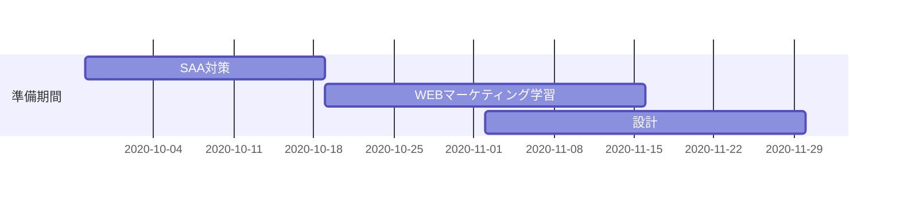
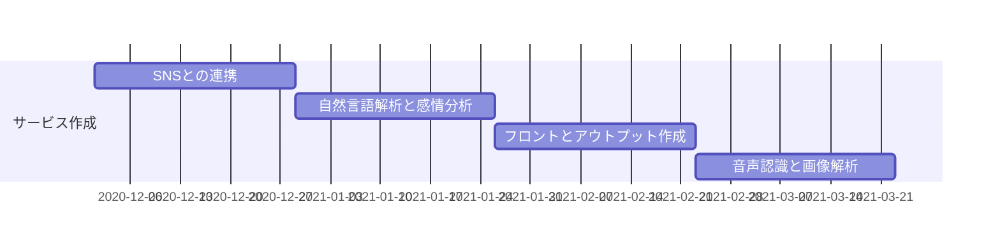

#### <u>AWSのサービスを用いたSNSマーケティングサイトの構築を目指す</u>  

雑多な情報が飛び交うSNSの中から、特定ワードを指定して

SNS上でそのワードに対してどのような感情を抱いているのか

解析を行う

---

### 使用予定技術
 - SNS側のAPI（Twitterを予定）

 - AmazonComprehend  
   自然言語解析・感情分析

 - AmazonRekognitin  
   画像解析

 - AmazonTranscribe  
   音声認識

---

### ステップ

 - マーケティングとは？
 - SNSのAPIを使用した特定ワードの情報取得
 - 取得情報に対して「自然言語解析・感情分析」を実施
 - 結果のアウトプット
 - 上記を操作可能なフロント部分の作成(WEBサイト？チャットボット？)
 - その他上記に画像解析や音声認識での検索も詰め込めるか？

---

### スケジュール

