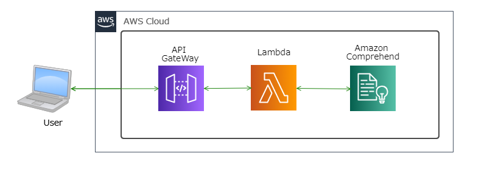

## <u>AWSのサービスを用いたSNSマーケティングサイトの構築を目指す</u>  

雑多な情報が飛び交うSNSの中から、特定ワードを指定して  
SNS上でそのワードに対してどのような感情を抱いているのか解析を行う

---

### 使用予定技術
 - SNS側のAPI（Twitterを予定）

 - AmazonComprehend  
   自然言語解析・感情分析

 - AmazonTranscribe  
   音声認識

 - AmazonRekognitin(?)   
   画像解析

---

### ステップ

- WEBマーケティングとは？  
  - [x] 書籍を読んでレポーティング  

- アウトプットイメージ及びサービス構成などの設計  
  - [ ] 随時実施  

- SNSのAPIを使用した特定ワードの情報取得  
  - [x] TwitterAPI申請  
  - [x] APIキーの払い出し終了  
  - [x] PythonのTweepyを使用して情報取得  

- 取得情報に対して「自然言語解析・感情分析」を実施  
  - [ ] STEP1 S3にデータをおいて手動で分析（Comprehed)  
  - [ ] STEP2 Lambda関数からComprehend実行  
  - [ ] STEP3 （仮）Twitter検索用のWEBサイト作成  
  - [ ] STEP4 （仮）Amazon Quicksightを用いて解析結果をグラフ化  

 - その他上記に画像解析や音声認識での検索も詰め込めるか？  
  - [ ] （仮）音声分析  

---

### アウトプットイメージ及びサービス構成などの設計(随時更新)  

- 1STEP目の構成、まずは、シンプルに手動で  

- 2STEP目の構成、Lambda関数からComprehend実行    

　
---

### その他

　Amazon Comprehend  
  　無料利用枠は、AWS の新規および既存両方を対象としており、初回の Amazon Comprehend リクエストを行った日から 12 か月間利用可能  
    50,000 単位のテキスト (500 万文字)  
   
    無料では無い場合：キーフレーズ抽出	0.0001USDくらい  
    詳しくはAWSのサイトを参照  
    　https://aws.amazon.com/jp/comprehend/pricing/  

