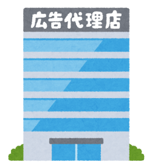

## 前回まで  

マーケティングに関する知識を持たない人間が「Webマーケティングの正解」(西俊明 著)  
を読んで理解したWEBサイトの構築に関してまとめた  

[WEBマーケティング(WEBサイト).md](WEBマーケティング(WEBサイト).md)  

---
## 用語一覧  
SNS　＝　social networking service  

---
## WEBマーケティングにおけるSNSの活用方法  

- SNSの利点  
   - 口コミによる情報発信・情報拡散が原則なので、商品・サービスの信頼性を確認しやすい。  
   - 静止画や動画、文章など様々な形で情報が流れてくるのでチェックしやすい  
   - 情報発信者の思いをしることができる  

SNSの利点は上記の通り、人のつながりを利用することで、相手と信頼関係を構築しやすいツールということが言えます。  
とはいえ、いきなり「この商品買ってほしい」という宣伝をすると押し売りととられて、信頼関係の構築どころか商品（企業）に対するネガティブなイメージを持たれる可能性があります。  
その為。顧客が交流している中に、商品やサービスを入れて情報の交換をさせてもらう。企業アカウントであれば顧客にとって有益と思ってもらえる情報などを流す等の  
販促行為ではなく、信頼関係構築の為の交流会的な使い方があっているといえます。また、商品開発などの経過を見せることなども有用と思います。  

- SNSの使用方法  
SNSは「集客」「購入前の信頼構築」「アフターフォロー」で利用できます。  
「集客」は顧客に商品、サービス、会社に気付いてもらうフェーズです。  
「購入前の信頼構築」はいままでずっと説明してきた通り、最も重要なフェーズといえます。  
「アフターフォロー」これまであまり触れてこなかったフェーズなのですが、「ファン、リピーター」になってもらえるかはここでどれだけ手間をかけられるかにかかってきます。  
「集客」は別ですが「購入前の信頼構築」「アフターフォロー」共に信頼関係の構築がメインです。  
どれだけ有用な情報を提供できるか？顧客に特別を感じてもらえるか？というところを意識したSNSの活用が重要ということになります。  

---
## 4大SNSツール

- Facebook  
世界で最も利用者が多いSNS。実名制なので、現実世界の人間関係をネット上で構築しやすい為、信頼構築をする際に使用するのに適しているツールといえます。  
「いいね」や「シェア」などユーザーが価値があると思った情報がユーザーのコミュニティに拡散されやすくなります。  
「Facebookページ」とよばれる企業の公式アカウントを作成可能  

- Twitter  
文字制限のあるミニブログサービス。気軽に使用できるのが利点で情報の拡散がしやすいのが特徴です。  
企業としての使い方としては自社ブログへの流入ルートや商品の動画を張るなどの広告的な使い方、担当者のつぶやき的な日常を織り交ぜることによる信頼関係の構築等になります。  
ただ匿名で使用可能なので、公式マーク等の活用が必須です。  

- instagram  
写真や動画を中心に扱うSNSで、4大ツールのなかでは一番勢いがあるといわれています。  
ビジュアルで訴求が可能な商品や、ビジュアルが重要な商品の訴求に関していえば、一番訴求効果が高いと思いますが、  
ビジュアルの見せ方等もおしゃれであることが求められますのでハードルは低くはありません。  
instagramにはECへ誘導する機能もありますので、うまく使えば販売促進にもつなげることができます。  

- LINE  
他のサービスと違い、特定の相手とのメッセージ交換が主用途のため、広範囲に自動で拡散するようなことはありません。  
有償サービスで「LINE公式アカウント」が利用可能です。飲食店などに行った際に更「公式LINE登録で〇〇サービス」といったのを見たことがあるかと思います。  
他のサービスよりも情報が埋もれにくく、チラシやクーポン配布での集客などに適しています。  

一つ一つそれぞれの特性を生かした訴求方法や注意点等があり、またいろいろなテクニックも「Webマーケティングの正解」には記載されていました。  
ただどれをとっても、ユーザーとの信頼関係を構築するにはどうするのかを主題としていました。  
口こみよる情報の拡散は噂レベルものでも拡散してしまい、情報の真偽がわからなくなるものも多いので、そういった点も考慮していわゆる炎上しないように注意する必要があるなと感じました。  
Facebookを履歴書として就活するといった話も昔あったなと思うので、活用方法次第で可能性はまだまだあるのかなとも思います。  

---
## WEB広告の活用  

WEBサイトは作成後すぐに効果を出すのはどのようなサイトでも不可能です。  
ユーザーにアクセスしてもらい、プロセスや結果を分析ツールを使用して解析を行い、WEBサイトの修正や調整を繰り返すことで成果の出せるサイトへと成長していきます。  
その為にまずは、ユーザーに見てもらう必要があります、そこで活用できるのがWEB広告となります。  

 - リスティング広告  
googleやyahooなどの検索時に検索結果画面に表示される広告になります。検索結果の上位を買うという形になります。  
クリック課金という方式がとられており、1日の広告予算を決めて掲載するなど柔軟な設定が可能です。  
リスティング広告から流入する場合は明確な目的があってWEBサイトを見ていますので、ターゲットがちょっとでもずれていると離脱されてしまいます。  
1クリックいくらという形になりますので、少ないクリック数で高い効果があるほうがコストメリットが高くなります。  
その為重要となってくるのが、ランディングページとなります。  

 - ランディングページ  
検索結果や別のサイト、リスティング広告をクリックして訪問した際に一番初めに表示されるぺージのことです。  
検索結果や別のサイトからの訪問の際は、企業のトップページや目的のコンテンツページでいいのですが、  
リスティング広告からの訪問した際のランディングページを企業のトップページにするよりも、専用のランディングページを作る方が効果的です。　　
   - 専用のランディングページ  
   専用のランディングページを作ることで、検索ワードにマッチしたサイトを作成することができます。  
   「Webマーケティングの正解」では例として婚活サイトを上げていましたが、通常の婚活サイトはどの年代が来てもいいようにトップページは幅広い年齢層に向けたページとなっているはずです。  
   「30代　婚活」で検索された際に出てきたリスティング広告をクリックした場合に、通常のトップページが出て来てしまうと、30代用の婚活をサイト内で探す手間が生まれてしまいます。  
   また検索時にたまたま20代向けのキャンペーンか何かをしていた場合、30代向けでは無かったとページを離脱されかねません。  
   そういった離脱率を下げる上でも専用サイトを用意することは有用となります。  

   - 専用のランディングページの構成  
   専用のランディングページの場合、ページ遷移が無く1枚もののページがよく見られます。  
   これは遷移がおおいとどうしても、途中で離脱されてしまうことが多い為、目的まで一直線に進ませるページが多くなっています。  
   またこの専用サイトはリスティング広告からの専用サイトとなる為、検索順位を気にする必要がない為、SEO対策の考慮が不要となります。  

 - その他の広告
Facebook広告等のSNS向けの広告、youtubeの広告、ブログの横などに表示されているディスプレイネットワーク広告など
いまやWEB上いたるところに広告がある状態です。  
広告とは少し違いますいが、「googleマイビジネス」というサービスもあり登録することでgoogleマップやgoogle検索の地図上に  
お店情報を乗せることができ口コミや店舗情報等も載せることができるものになります。  
こちらも無料でできるので、店舗があるような商売であればSEO対策同様に力をいれておけば強力な訴求効果を埋めるツールといえます。  

最初に「Webマーケティングの正解」を読んだ際には、ランディングページからのメインサイトへのつなぎはどうするのだろうかと思いましたが、  
何度か読んでいるうちに、リスティング広告 → ランディングページ → ランディングページの目的が資料請求で終わっているのであれば、  
資料請求後のアフターサービスでメインサイトのコンテンツに誘導し、メインサイトを何度も見てもらったりSNSのやり取りで信頼関係の構築を行うといった、
アフターサービスでメインサイトのほうに誘導するのかと気付きすべて繋げて初めて効果が出てくるものなのだとあらためて感じました。  

---
## 最後に  
WEBマーケティングにおけるSNSの活用についてとWEB広告に関してまとめました。  
正直SNSに関しては一つ一つツールに向けた施策等が違ってあるので、全部はまとめ切れていません、それだけ奥深く可能性があると思っています。  
この後、特定のワードがSNS上でどのようにとらえられているかを分析するサイトを構築する予定ですが、  
これはWEBサイトのコンテンツ作成時に便利なサイトとして紹介したキーワードを見つける為のサイトと似たような効果はあるなと思っています。  

いまや何をしていてもどこにいても広告があふれている状態で、広告の情報過多という時代だと思います。  
その中で、企業、商品、サービスに興味をもってもらう一歩目がいかに難しく、興味を持続してもらう為にどれだけの施策が必要なのかなど  
WEBマーケティングに限らず既存のマーケティングや自分の現在業務に置き換えても考え方を流用できる部分等もあり価値ある知識となったと感じています。  
ただWEBマーケッターとして生きていくならば、まだまだ学習が必要だなともおもいました。  

次は、上でも少しふれていますが、AWSのサービスを用いてSNS上のワードを解析するサイト作成予定です。  

---
