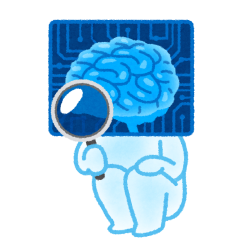

## 前回まで  

マーケティングに関する知識を持たない人間が「Webマーケティングの正解」(西俊明 著)  
を読んで理解したマーケティングやWebマーケティングとは何かの概念をまとめた

[WEBマーケティング.md](WEBマーケティング.md)

---
## 用語一覧  

UI　＝　User Interface  
SEO　＝　Search Engine Optimization（検索エンジン最適化）  

---
## WEBサイトの基本

 - ユーザーの動線  
WEBサイトを閲覧するユーザーの属性は様々です。  
初めてWEBサイトを閲覧するユーザーもいれば、何度かサイトを訪れているリピーターの方かもしれません。  
その為、WEBサイトの構成を考える際に重要なのが、訪問してくれたユーザーにどのような行動をとってほしいのかという動線を想定することになります。  
例えば、初めてWEBサイトに訪問したユーザーの動線イメージとしては  
「初めての方へ（代表挨拶）」→「今までの実績や選ばれる理由」→「お客様の声」・・・  
のように訴求したいコンテンツを訴求したい順番で閲覧するように誘導できる構成とするのが重要です。  
またWEBサイトを公開した後は、ユーザーがどのページで離脱しているのかをチェックして、離脱率の高いページを改善するというのも重要です。  

 - リピーター向けコンテンツで信頼を獲得する  
大抵のユーザーは競合他社と比較検討し、何度かWEBサイトを訪れてようやく行動に移します。  
何度もWEBサイトを訪れてもらえるように価値あるコンテンツを定期的に更新するなどの施策を実施することで  
徐々に信頼関係が構築されていき、WEBサイトのファンとなってもらえるようになります。  
商品の購入や問い合わせ等を行動を起こしてもらえるまで、何度でもユーザーに訪問してもらえるようなコンテンツの準備というのも  
動線と合わせて重要な要素となります。  

 - Webサイトの目的を絞る  
WEBサイトの目的設定が動線、コンテンツを考える上での基礎なるので何のためのWEBサイトなのかを明確にすることも重用となります。  
例えば、リアル店舗に訪れてもらいたいという目的のWEBサイトに、アルバイト募集の目的を足してしまうと  
動線もコンテンツもぶれてしまいます。  
この場合は、リアル店舗に訪れてもらいたいという目的のWEBサイトとアルバイト募集の目的のWEBサイトの両方を作成するべきです。  
WEBサイトは目的の数だけ作ることが重要となり、WEBサイトを考える上での基本となります。  

とてもおしゃれなサイト等数多ありますが、重用なのは目的であり、コンテンツだということを「Webマーケティングの正解」では説明しています。  
当たり前ではありますが、とてもおしゃれなサイトは一度は見てもらえるかもしれません、しかしコンテンツが物足りなければ、再度そのサイトに訪問しようとは考えないでしょう。  
逆に凡庸なデザインではあるが、コンテンツが面白いと感じれば再度サイトを訪れたいと考えます。  
とはいえ、どこに購入ボタンがあるのかわからないとかサイト内の移動がし難い等のデザインの良くないサイトの場合、いくらコンテンツがよくても結果には結びつかないでしょう。  

その為、重用なのは目的であり、コンテンツとしつつも「目的のボタンを目立たせる」等のUIも重要であることも記載されています。  
UIはUIで本が出ているようなものなので、「Webマーケティングの正解」の中ではあまり深くは触れられていませんが、  
UIを抑えることでユーザーとの信頼関係構築が早くなるのでは無いかなと感じました。  

---
## ユーザーにも検索エンジンにも好かれるWEBサイト

 - WEBサイトの構造を正しく伝える  
「このWEBサイトは何が書かれているのか」「どこにどのようなコンテンツがあるのか」  
ということを、見てもらうユーザーにはもちろんのこと、google等の検索エンジンにも  
十分に理解してもらう必要があります。  

 - 内部リンク  
大抵のWEBサイトは階層構造になっていると思いますが、階層の深さは多くても3から4階層としておくべきです,  
あまり深い階層だとユーザーも検索エンジンも迷子になってしまいます。  
また、どのページにいても目的のページに行けるように、WEBサイト内部のリンクを張り巡らせること必要です。  
内部リンクを張り巡らせないと、クローラー(サイトの構造などをチェックするgoogleのプログラム、googlebot）がWEBサイト全体のチェックしてくれないので  
検索時にそのページがヒットしなくなります。     
具体的には、各ページからTOP、HOMEに戻るといった、一方通行のリンクを受けておくことで、ユーザーの利便性もあがり、  
一方的なリンクがたくさん張られていることで、クローラーのほうで重要度が高いページ、価値の高いページだと認識してくれるようになります。  
結果的に、検索した際に上位に出てきやすくする施策ともなります。  

 - パンくずリスト  
「TOP　＞　商品一覧　＞　デジカメ」
上記のように現在自分がどこにいるのかわかりやすく表示してくれるナビゲーションのことを「パンくずリスト」と言います  
このパンくずリストは各テキストがアンカーテキストとなっているので、内部リンクの強化となりまし、  
何より視覚的にわかりやすいのでユーザーにサイト構造を伝えやすいメリットがあります。  

 - サイトマップ  
WEBサイトの中にどんなページがあるのかを一覧にしたものになります。  
一覧のそれぞれの要素はアンカーテキストとなっているので、ユーザーも行きたいページにすぐに行けますし、こちらも内部リンクの強化となります。  
また、「ユーザーに見せるサイトマップ」以外に、googleの為に用意する「検索エンジン向けのサイトマップ」というのもあります。  
こちらは全ページのアドレスを一つのファイルに書き込み、googleに送ることで、あらかじめWEBサイトを知ってもらい、検索エンジンのデータベースに登録される手助けとなります。  

※作成方法等は「サイトマップの作成方法」などで検索すると出てきます。

 - キーワードを意識したコンテンツ  
ペルソナにどんなキーワードでWEBサイトに訪問してほしいかを考える必要があります。  
「AWS試験 スクール」「AWS試験 費用」「AWS試験 講座」「AWS試験 学習方法」  
上記は全てAWSの認定試験を受けたいと思った人が検索するワードだと思います。  
こういった関連ワードを含んだコンテンツを少しづつ増やしていくことで、検索エンジンに対して  
今回の例であれば、「AWS試験に関する情情報発信をしている」と正しく認識してもらえます。  

コンテンツの増やす方法としてはブログ記事などで簡単にコンテンツを増やすことができますが
ブログ記事に埋め込むキーワードを見つけるのが難しいかと思います。  
そんな時に無料で使える便利なサイトというものもあります。  
キーワードを入力すると関連ワードが一覧で表示されます。  

[ラッコキーワード](https://related-keywords.com/ "ラッコキーワード")

せっかくコンテンツに盛り込んだキーワードでも、検索回数が少ないものであればあまり訴求効果はありません。
その為キーワードが実際にどのくらいの回数で検索されているのか？といったのもキーワード選びでは重用になってきます。
そういったものを調べる（予測）してくれるサイトというものもあります。

[aramakijake.jp](https://aramakijake.jp/ "aramakijake.jp")

上記のようなサイトを上手に活用することで、コンテンツ作成時の一助として、良いキーワードを発見するのが重用なSEO対策になるという話ですが、  
このような便利なサイトが無料で使えるということに驚き、またどうやって予測や情報を集めているのかという疑問というか興味がわきました。  
関係ありませんが、探せばま無料で有益な情報を提示してくれるサイトというのがあるので、既に有りそうですが、それをまとめるサイトといのも面白そうだなと感じています。  

---
## 検索順位を上げる施策（内部施策）

検索エンジンはWEBサイトをページ単位で評価しています。  
では、検索エンジンはWEBサイトのどこを見て、何が書いてあるか判断しているのか？  
もっとも重視されているのは、「タイトルタグ」「見出しタグ」「メタディスクリプション」の三つです。  

 - タイトルタグ  
読んで字の如く、WEBページのタイトルを設定するタグになります。  
googleなどの検索結果画面や、ブラウザのタブのところに表示されているテキストになります。  
このタイトルには必ずキーワード、検索時に使用されるワードを含めてください。  
ただあまりにもキーワードが多いと不自然でスパとみなされる恐れがあるので、1から2個のキーワードにしておきましょう。  

 - 見出しタグ  

 - メタディスクリプション  

---
## 検索順位を上げる施策（外部施策）

sample  

---
## 検索順位を上げる施策（キーワード選び）

sample  

---
## 中締め

sample
[WEBマーケティング(SNSの活用とWEB広告).md](WEBマーケティング(SNSの活用とWEB広告).md)

---
