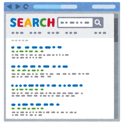
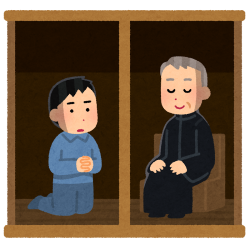

## 前回まで  

マーケティングに関する知識を持たない人間が「Webマーケティングの正解」(西俊明 著)  
を読んで理解したマーケティングやWebマーケティングとは何かの概念をまとめた

[WEBマーケティング.md](WEBマーケティング.md)

---
## 用語一覧  

UI　＝　User Interface  
SEO　＝　Search Engine Optimization（検索エンジン最適化）  

---
## WEBサイトの基本

 - ユーザーの動線  
WEBサイトを閲覧するユーザーの属性は様々です。  
初めてWEBサイトを閲覧するユーザーもいれば、何度かサイトを訪れているリピーターの方かもしれません。  
その為、WEBサイトの構成を考える際に重要なのは、訪問してくれたユーザーにどのような行動をとってほしいのかという動線を想定することになります。  
例えば、初めてWEBサイトに訪問したユーザーの動線イメージとしては  
「初めての方へ（代表挨拶）」→「今までの実績や選ばれる理由」→「お客様の声」・・・  
のように訴求したいコンテンツを訴求したい順番で閲覧するように誘導できる構成とするのが重要です。  
またWEBサイトを公開した後は、ユーザーがどのページで離脱しているのかをチェックして、離脱率の高いページを改善するというのも重要です。  

 - リピーター向けコンテンツで信頼を獲得する  
大抵のユーザーは競合他社と比較検討し、何度かWEBサイトを訪れてようやく行動に移します。  
何度もWEBサイトを訪れてもらえるように価値あるコンテンツを定期的に更新するなどの施策を実施することで  
徐々に信頼関係が構築され、WEBサイトのファンになってもらえます。  
商品の購入や問い合わせ等を行動を起こしてもらえるまで、何度でもユーザーに訪問してもらえるようなコンテンツの準備というのも  
動線と合わせて重要な要素となります。  

 - Webサイトの目的を絞る  
WEBサイトの目的設定は「動線」「コンテンツ」を考える上での基礎となるので何のためのWEBサイトなのかを明確にする必要があります。  
例えば、リアル店舗に訪れてもらいたいという目的のWEBサイトに、アルバイト募集の目的を足してしまうと  
動線もコンテンツもぶれてしまいます。  
この場合は、リアル店舗に訪れてもらいたいという目的のWEBサイトとアルバイト募集の目的のWEBサイトの両方を作成するべきです。  
WEBサイトは目的の数だけ作るというのが、WEBサイトを考える上での基本となります。  

とてもおしゃれなサイトを作るよりも、重用なのは目的であり、コンテンツだということを「Webマーケティングの正解」では説明しています。  
当たり前ではありますが、おしゃれなサイトは一度は見てもらえるかもしれません、しかしコンテンツが物足りなければ、再度そのサイトに訪問しようとは考えないでしょう。  
逆に凡庸なデザインではあるが、コンテンツが面白いと感じれば再度サイトを訪れたいと考えます。  
とはいえ、どこに購入ボタンがあるのかわからないとかサイト内の移動がわかりにくい等のデザインが良くないサイトの場合、いくらコンテンツがよくても結果には結びつかないでしょう。  

その為、重用なのは目的であり、コンテンツとしつつも「目的のボタンを目立たせる」等のUIも重要であることも記載されています。  
UIはUIで本が出ているようなものなので、「Webマーケティングの正解」の中ではあまり深くは触れられていませんが、  
UIを抑えることでユーザーとの信頼関係構築が早くなるのでは無いかなと感じました。  

---
## ユーザーにも検索エンジンにも好かれるWEBサイト

 - WEBサイトの構造を正しく伝える  
「このWEBサイトは何が書かれているのか」「どこにどのようなコンテンツがあるのか」  
ということを、見てもらうユーザーにはもちろんのこと、google等の検索エンジンにも  
十分に理解してもらう必要があります。  

 - 内部リンク  
大抵のWEBサイトは階層構造になっていると思いますが、階層の深さは多くても3から4階層としておくべきです,  
あまり深い階層だとユーザーも検索エンジンも迷子になってしまいます。  
また、どのページにいても目的のページに行けるように、WEBサイト内部のリンクを張り巡らせることも必要です。  
内部リンクを張り巡らせないと、クローラー(サイトの構造などをチェックするgoogleのプログラム、googlebot）がWEBサイト全体のチェックしてくれないので検索時にそのページがヒットしなくなります。     
具体的には、各ページからTOP、HOMEに戻るといった、一方通行のリンクを設置しておくことで、ユーザーの利便性もあがり、  
一方的なリンクがたくさん張られていることで、クローラーのほうで重要度が高いページ、価値の高いページだと認識してくれるようになります。  
結果的に、検索した際に上位に出てきやすくする施策ともなります。  

 - パンくずリスト  
「TOP　＞　商品一覧　＞　デジカメ」
上記のように現在自分がどこにいるのかわかりやすく表示してくれるナビゲーションのことを「パンくずリスト」と言います  
このパンくずリストは各テキストがアンカーテキストとなっているので、内部リンクの強化となりまし、  
何より視覚的にわかりやすいのでユーザーにサイト構造を伝えやすいメリットがあります。  

 - サイトマップ  
WEBサイトの中にどんなページがあるのかを一覧にしたものになります。  
一覧のそれぞれの要素はアンカーテキストとなっているので、ユーザーも行きたいページにすぐに行けますし、こちらも内部リンクの強化となります。  
また、「ユーザーに見せるサイトマップ」以外に、googleの為に用意する「検索エンジン向けのサイトマップ」というのもあります。  
こちらは全ページのアドレスを一つのファイルに書き込み、googleに送ることで、あらかじめWEBサイトを知ってもらい、検索エンジンのデータベースに登録される手助けとなります。  

※作成方法等は「サイトマップの作成方法」などで検索すると出てきます。

 - キーワードを意識したコンテンツ  
ペルソナにどんなキーワードでWEBサイトに訪問してほしいかを考える必要があります。  
「AWS試験 スクール」「AWS試験 費用」「AWS試験 講座」「AWS試験 学習方法」  
上記は全てAWSの認定試験を受けたいと思った人が検索するワードだと思います。  
こういった関連ワードを含んだコンテンツを少しづつ増やしていくことで、検索エンジンに対して  
今回の例であれば、「AWS試験に関する情情報発信をしている」と正しく認識してもらえます。  

コンテンツを増やす方法であれば、ブログ記事を掲載するなど簡単にコンテンツを増やすことができますが  
ブログ記事に埋め込むキーワードを見つけるのが難しいかと思います。  
そんな時に無料で使える便利なサイトというものもあります。  
キーワードを入力すると関連ワードが一覧で表示されるラッコキーワード  

[ラッコキーワード](https://related-keywords.com/ "ラッコキーワード")

せっかくコンテンツに盛り込んだキーワードでも、検索回数が少ないものであればあまり訴求効果はありません。  
その為キーワードが実際どのくらいの検索回数があるのか？といったのもキーワード選びでは重用になってきます。  
そういったものを調べる（予測）してくれるサイトというものもあります。  

[aramakijake.jp](https://aramakijake.jp/ "aramakijake.jp")

コンテンツ作成時に上記のようなサイトを活用し、良いキーワードを発見するのが重用なSEO対策になるという話です。  
このような便利なサイトが無料で使えるということに驚き、またどうやって予測や情報を集めているのかという興味がわきました。  
関係ありませんが、探せば他にも無料で有益な情報を提示してくれるサイトというのがありそうなので、それをまとめるサイトといのも面白そうだなと感じています。  

---
## 検索順位を上げる施策（内部施策）

検索エンジンはWEBサイトをページ単位で評価しています。  
では、検索エンジンはWEBサイトのどこを見て、何が書かれているのかを判断しているのか？  
もっとも重視されているのは、「タイトルタグ」「見出しタグ」「メタディスクリプション」の三つです。  

 - タイトルタグ  
読んで字の如く、WEBページのタイトルを設定するタグになります。  
googleなどの検索結果画面や、ブラウザのタブのところに表示されているテキストになります。  
このタイトルには必ずキーワード、検索時に使用されるワードを含めてください。  
ただあまりにもキーワードが多いと不自然でスパムとみなされる恐れがあるので、1から2個のキーワードにしておくべきです。  

 - 見出しタグ  
雑誌の見出しに相当するもので、「h1」タグが大見出し、「h2」～「h6」タグが小見出しとなります。  
雑誌等でもそうであるように、大見出しはページに一つ、小見出しは複数設定可能で、設定の際には「h2」タグのトピックの中でまた小見出しが必要であれば「h3」タグを使用するといった関係で使用していきます。  
見出しの書き方にも、タイトルタグ同様キーワードを含めて書く必要があり、目を引く部分にもなりますので、自然な日本語で魅力的な文章になるように意識すべきです。  

 - メタディスクリプション  
「サイトの説明分」、「概要」のことで、google等で検索した際にタイトルの下に2，3行のテキストが表示されていると思いますが、それのことなります。  
どんなことが書いてあるサイトなのかを説明する重要なテキストになります。もちろんここにもキーワードを含めておく必要があります。  
記載方法としてはメタタグになりますのでヘッダータグ内に記載するものになります。  

 - googleのサーチコンソール  
「どういったキーワードで、何回くらいユーザーが流入しているのか？」「googleがWEBサイトをどのように認識しているのかのチェック」「サイトマップの登録」  
といった内部施策がgoogleに対して正しく認識してもらえているか？選択したキーワードが当たっているかなど今まで説明してきた施策の結果を確認することが可能なツールとなります。  
これは、googleのアカウントがあれば無料で利用可能です。  
利用方法は検索してもらえればと思います。  

---
## 検索順位を上げる施策（外部施策）

「他のサイトから自分のサイトへのリンクを貼ってもらう」これが外部施策になります。

 - なぜ、他のサイトからリンクを貼ってもらうことがSEO対策となるのか？  
検索エンジンは、ユーザーが求める有用な情報が掲載されているサイトをできる限り上位に表示されるようにしたいと考えています。  
googleでは「多くのサイトからリンクを集めているサイトは有益なコンテンツが掲載されている」と判断するようになっています。  
さらに「ページランク」という概念で各WEBサイトを評価しています。評価基準は多岐にわたるのですが、ここで重要なのは外部からの一方的なリンクも評価基準になっている点です。  
外部からの一方的なリンク数が同様な二つのサイトがあった場合、評価が高いサイトからリンクをもらっているサイトの方が評価が上になります。   
既に評価の高いサイトからリンクをもらっているサイトは、良い情報を提供してくれるサイトだろうと判断されるということです。  
（ページランクの評価基準等に興味がある方は「ページランク」で検索すると少ないない数の説明サイトが出てきますのでそちらを確認いただければと思います。）  

 - サテライトサイト  
外部からの一方的なリンクを集める手段として、有用なのが無料ブログサービス等を使用して「担当者ブログ」等のサテライトサイトを作成することです。  
サテライトサイトを作成することで、サテライトサイト経由でのアクセスが見込める、SEO対策として外部からの一方的なリンクを集めることができる、  
社員ブログ等の記事であれば、親しみやすさを訴求して企業への信頼度向上に貢献することができる等のメリットがあります。  
サテライトサイトの注意点としては、  
   - サテライトサイトからメインサイトへのアンカーリンクのテキスト文章は複数用意した上で、自然な文章とする。  
   同一の文言でたくさんのリンクが貼られているとgoogleの方から不自然と見られてしまう可能性がある。
   - 複数のサテライトサイトを作る場合は、使用するブログサービスを変える、またIPアドレスを異なるものにする。  
   IPアドレスが一緒の場合、同じ発信元と認識されてしまい外部からのリンクと認識されない可能性がある。  
   - サテライトサイトの方も内部施策をしっかりと行い、放置しない。  
   「ページランク」で少し説明されていますが、いかに評価の高いサイトからのリンクをもらえるかが重要なので、  
   放置してしまうとサテライトサイトの「ページランク」が低くなってしまい、逆にメインサイトの足を引っ張りかねません。  

SEO対策は外部リンクを集めるということを聞いたことがありましたが、ようやく意味が理解出来ました。  
重要なのは、評価の低いサイトからいくつもリンクもらうよりも評価の高いサイト一つからリンクをもらう方がSEO対策としては有用だということですね。  
このあたりにgoogleの努力を感じましたし、WEBページの運営としては正しい情報をgoogleに届け続けなければならないところにSEO対策の難しさを感じました。  

---
## ペナルティ対策

外部施策で説明してある通り、外部からの一方的なリンクをたくさん貼ってもらえれば、価値の低いサイトでも価値の高いサイトになることが可能です。  
この考え方を逆手にとって、業者にお金を払い、たくさんのリンクを貼ってもらうという事態が多く発生しています。  
これに対応する為に、googleはガイドラインを設け、業者からリンクを買うような方法を取ったWEBサイトにペナルティを与えるなどをしています。  
実際には業者等にはお金を払っていなくてもペナルティを受ける場合もあります。  
WEBサイトの順位が下がったり、検索結果に出てこない等が発生した場合、ペナルティも含めて3つほど要因が考えられます。  

 - googleのアルゴリズムに変更があった  
ペナルティではなくアルゴリズムの変更によって、一時的に順位が下がることがあります。  
アルゴリズムの変更に関しては情報収集をこまめに行い、早めに情報をつかむことであたふたする必要が無くなります。  
問題がないサイトであれば2週間もあれば順位は戻るそうです。  
逆に2週間たっても戻らない場合はペナルティを受けている可能性があります。  

 - アルゴリズムによる自動ペナルティ判定に引っかかった  
アルゴリズムによる自動ペナルティの場合は通知がきません。急に順位が下がったが、アルゴリズムの変更がない、ペナルティに思いあたる箇所があるといった場合は  
ペナルティになりそうな部分の改善をすることで、検索結果が戻る可能性がありますが、以前と同じ順位になることは少ないそうです。  

 - googleの担当者による手動ペナルティ判定に引っかかった  
検索結果に出てこないなどの厳しいペナルティは手動ペナルティの場合のみです。  
手動ペナルティの場合、通知が来ているので通知内容に従い対応を行い、再審査に合格することでペナルティが解除されます。  
ただペナルティが解除されてすぐにペナルティ前の状態になるとは限らないようです。  

ペナルティに関して、自動判定された場合に通知が来ないというのが一番怖いです。  
アルゴリズムに関する情報の収集と、ユーザー、google双方に好まれるサイトの構築運営を地道に行っていくというほか、対策という対策が見当たらないです。  

---
## 中締め

今回はWEBマーケティングの知識を生かしたWEBサイトの構築・運営に関して、実戦とは言えませんが、実際に使えるサイト等も紹介しつつまとめてみました。  
個人的には検索キーワードで使える無料のサイトの存在は面白いサイトだなと思いました。  
こういったサイトが無料で使用できることを知っているか知らないかでもだいぶ構築時の手間もユーザーへの訴求効果も変わってくるなと感じました。  

また上記のまとめ内では説明していませんが、googleアナリティクスというgoogleが提供する高機能なアクセス解析ツールがあります。  
「セッション」「ユーザー」「ページビュー(PV)」「新規ユーザー/リピートユーザー」「参照元」「直帰率」「平均セッション時間」といった情報のチェックや解析が可能となります。  
[googleアナリティクスのスタートガイド](https://support.google.com/analytics/answer/1008015 "googleアナリティクスのスタートガイド")  

ただより怖いものはないと言いますが、無料でできることを知らないのも怖いなと思います。  
次は、SNSと広告についてまとめと所感を書いていきます。  
[WEBマーケティング(SNSの活用とWEB広告).md](WEBマーケティング(SNSの活用とWEB広告).md)  

---
